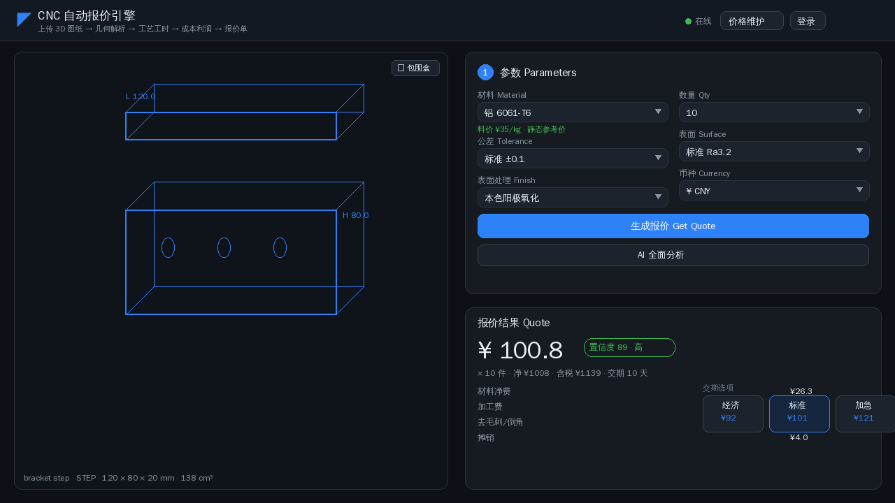
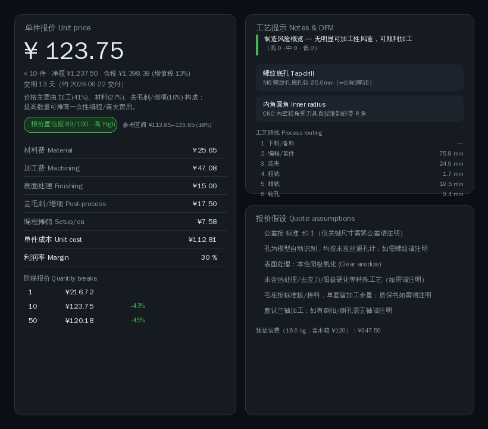
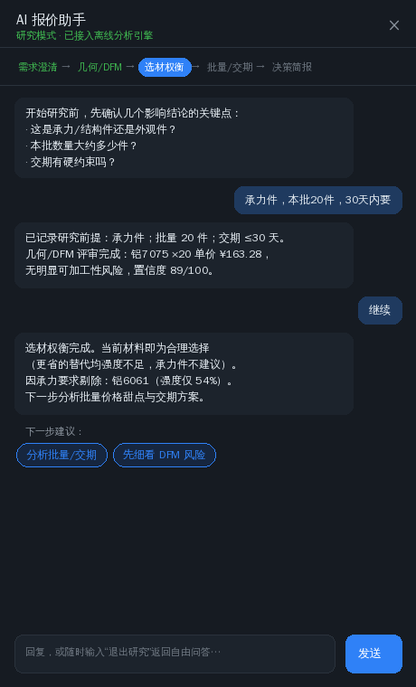
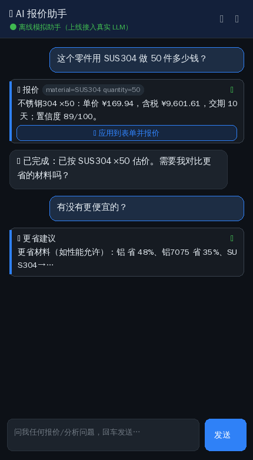
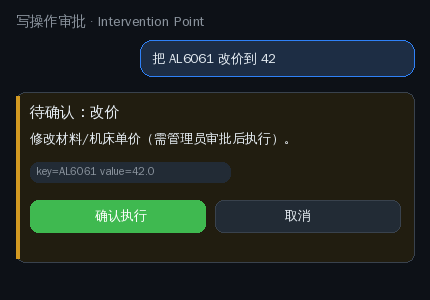
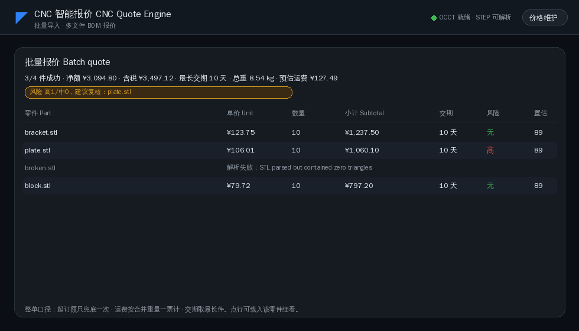

# CNC 智能报价引擎 · 使用说明 User Guide

> 上传 3D 图纸 → 自动几何/工艺分析 → 透明成本与交期 → 一键报价单。
> 内置可引导整条研究流程的 AI 分析伙伴，支持多文件批量报价。

> 截图为高保真示意图，精确还原应用的深色主题与真实页面内容（运行环境无法
> 下载无头浏览器二进制，故以与 `cnc/static/style.css` 同色板的 mock 呈现；
> 可用 `python doc/make_feature_mockups.py` 重新生成）。

---

## 目录 Contents

1. [快速开始 Quick start](#1-快速开始-quick-start)
2. [主界面：上传与报价 Main page](#2-主界面上传与报价-main-page)
3. [报价结果详解 Quote result](#3-报价结果详解-quote-result)
4. [AI 研究模式 Guided research](#4-ai-研究模式-guided-research)
5. [AI 自由问答 Copilot chat](#5-ai-自由问答-copilot-chat)
6. [批量报价 Batch quote](#6-批量报价-batch-quote)
7. [价格/参数维护 Price maintenance](#7-价格参数维护-price-maintenance)
8. [接口速查 API reference](#8-接口速查-api-reference)

---

## 1. 快速开始 Quick start

```bash
pip install -e .            # 或 pip install -r requirements.txt
export CNC_ADMIN_PASSWORD=your-strong-password   # 不设则种子为 admin/admin 并告警
uvicorn cnc.api:app --host 0.0.0.0 --port 8000
# 浏览器打开 http://localhost:8000
```

可选能力（缺失会优雅降级）：
- `trimesh` + `shapely` → 刀路仿真工时（更精确）；缺失回退解析法
- `opencascade`/OCCT → STEP/IGES 自动解析；缺失则 STEP 需手动填尺寸
- `opencamlib` → 自由曲面 drop-cutter 工时精修
- `AI_PROVIDER` + 密钥 → 接入真实 LLM；不设则使用离线确定性助手

---

## 2. 主界面：上传与报价 Main page



**怎么用：**
1. 把 `.step / .stp / .igs / .iges / .stl` **拖入左侧视图区**，或点击选择文件。
   支持**多选**——选 2 个及以上文件自动进入[批量报价](#6-批量报价-batch-quote)。
2. STL 会自动识别**孔位与最小壁厚**；STEP 经 OCCT 解析为实体。
3. 右侧填参数：材料、数量、公差、表面处理、币种。料价旁显示来源
   （静态/实时行情/改价）。
4. 点 **生成报价 Get Quote** 出价，或 **AI 全面分析** 让助手主导研究。

视图工具栏可切换包围盒、自动旋转、复位视角；底栏显示文件名、格式、外形尺寸、体积。

---

## 3. 报价结果详解 Quote result



一屏看懂"这个价怎么来的"——不是黑盒：

| 区块 | 内容 |
|------|------|
| **单价 + 区间** | 大字单价；按置信度给参考区间（高±8/中±15/低±25%），诚实表达估算不确定性 |
| **价格构成** | 一句话点出前三成本项及占比（小批量凸显编程/装夹摊销，大批量凸显加工/材料） |
| **成本明细** | 材料净费 / 加工费 / 表面处理 / **去毛刺增项** / 编程摊销，各行求和 = 单件成本，可手算对账 |
| **阶梯报价** | 1/5/10/25/50/100 件单价与相对节省%，量大从优一目了然 |
| **制造风险概览** | DFM 分级徽标（高/中/低计数 + 一句话结论），无风险给绿色正向信号 |
| **工艺路线** | 下料→编程→装夹→粗铣→精铣→钻孔→攻丝→检验，逐工序工时 |
| **报价假设** | 公差/螺纹/表面/热处理/毛坯的确定性清单，减少 RFQ 来回 |
| **交期** | 日历交付日期；备料(非常备料)+加工产能+外协表面处理 串起全工序链 |

点 **导出 PDF** 生成客户可用报价单（含工艺路线、阶梯节省列、报价假设）。

---

## 4. AI 研究模式 Guided research

把助手从"问答工具"升级为**引导整条研究流程的分析伙伴**：上传零件后点
**研究模式：引导式分析**，按五阶段主导分析，每步给可点击的"下一步"建议。



```
需求澄清 → 几何/DFM → 选材权衡 → 批量/交期 → 决策简报
```

- **需求澄清**：像真工程师开场就问关键约束——承力件吗？批量多少？交期硬约束？
  一句话自由文本作答即可（也可"跳过"按默认假设，假设会写进简报）。
- **约束改变结论**：承力件会**剔除强度不足的省钱替代**（如 AL7075→AL6061 仅 54%
  强度被拒）；外观件则放行更省材料。
- **批量/交期**：探测数量-单价曲线找**价格甜点**，校验标准交期是否满足客户期限，
  超期建议加急档。
- **决策简报**：前提/工艺/选材/批量交期/建议行动五段综合，可一键"按结论生成正式报价"。

顶部进度条显示当前阶段（高亮）与已完成（绿色）。随时输入"退出研究"返回自由问答。

---

## 5. AI 自由问答 Copilot chat



侧边栏自由问答：自然语言报价、对比材料、找更省方案、做 DFM 分析。
助手会调用工具并展示调用卡（做了什么/结果/置信度）。

**写操作需审批**（Intervention Point）：当 AI 提议改价等写操作时，**不会自动执行**，
而是弹出确认卡，需管理员登录并点确认后才生效——并写入审计日志（记录改前→改后旧值）。



> 设计约束：现在用离线确定性助手（可测）；上线设 `AI_PROVIDER` + 密钥即无缝切换
> 真实 LLM，无需改代码。流程状态始终由服务端规则持有，LLM 只负责语言化。

---

## 6. 批量报价 Batch quote

一次拖入多个零件文件（≤20 个），自动逐件报价并**按整单汇总**：



**整单口径**（这是关键业务决策，不是简单相加）：
- **起订额对整单只兜底一次**，而非每件各兜——两个各 ¥130 的小件合单 ¥260 > ¥200
  起订，不再各补差。
- **运费按合并重量一票计**（含木箱阈值判断），不是每件各算一份包装。
- **交期取最长件**；税按兜底后净额计。
- **风险汇总**：高/中/低计数 + 需复核清单（高中风险或置信 <60 的零件点名）。

单文件失败（如损坏的 STL）**隔离标红，不拖垮整批**。点任一成功行即把该零件
载入单件流程细看（3D 预览 / DFM / 完整报价）。

---

## 7. 价格/参数维护 Price maintenance

所有报价相关参数均可由管理员**运行时维护**，叠加在基础数据上（不改源文件），
改动立即对新报价生效，并写入审计（可单条/全部回退）。按标签页组织避免单页过长：


| 标签页 | 维护内容 |
|--------|----------|
| 材料 | 单价、密度、机加工性、毛坯系数、废料抵扣率、抗拉强度、备料周期 |
| 机床 | 时租、基础 MRR、最大轴数 |
| 表面处理 | 起步/每dm²/保底、外协周期 |
| 商务 | 利润率、税率、加急、去毛刺、包装、运费、起订额、有效期、日产能、刀耗、木箱阈值/费 |
| 系数 | 交期档、公差等级、表面等级、增项费 |
| 工时 | 编程/装夹/首件/检测/最小机时/毛坯余量 |
| 切削 | 按材料的 Vc/fz/切深/钻孔/攻丝进给 |

详见 [price-maintenance.md](price-maintenance.md) 与成本模型 [cost-model.md](cost-model.md)。

---

## 8. 接口速查 API reference

| 方法 | 路径 | 说明 |
|------|------|------|
| POST | `/api/parse` | 上传 CAD → 几何指标（+预览网格） |
| POST | `/api/quote` | 几何/手动尺寸 + 参数 → 完整报价 |
| POST | `/api/quote/batch` | 多文件 BOM → 逐件报价 + 整单汇总 |
| POST | `/api/quote/pdf` | 报价 payload → PDF 报价单 |
| GET | `/api/quotes` `/api/quotes/{id}` | 历史报价 / 重开 |
| POST | `/api/ai/chat` | AI 自由问答（工具调用） |
| POST | `/api/ai/research` | AI 研究流单步推进（状态随请求往返） |
| POST | `/api/ai/approve` | 审批并执行 AI 写操作（需管理员） |
| GET/PUT/DELETE | `/api/admin/*` | 价格/参数维护、配置、审计（需管理员） |
| GET | `/api/health` | 存活 + B-rep 内核 / AI provider / 实时料价状态 |

更多模型细节见 [cost-model.md](cost-model.md)、[ai-copilot.md](ai-copilot.md)。
