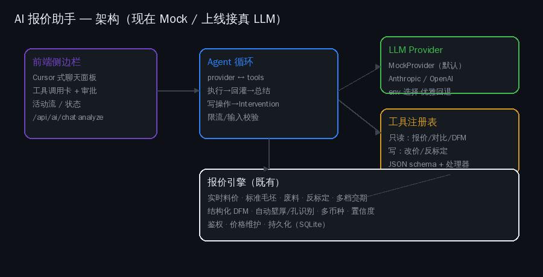
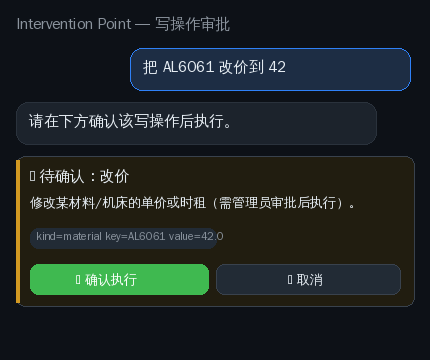
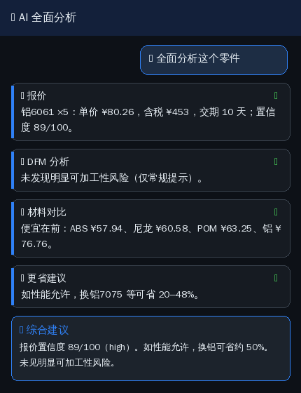

# AI 报价助手 · AI Copilot

一个 Cursor 式的侧边栏 AI 助手，可**调用本系统的工具代替人工操作**，对当前零件做
全自动的报价 / 对比 / DFM / 改价分析。

> **关键设计：现在用离线 Mock，上线接入真实 LLM。** 本环境未提供 LLM API（也无法
> 联网到 LLM），因此默认运行一个**确定性的 MockProvider**；上线时设置
> `AI_PROVIDER` + 密钥即可无缝切换到真实模型，**无需改代码**。这与系统里实时料价
> feed 的"实现 + 优雅回退"是同一套模式。

---

## 一、调研依据 Market basis

- **制造业 Copilot 是 2026 主线**：Mastercam Copilot、NX Manufacturing Copilot、
  CloudNC、bananaz（agentic 层编排专用 agent）、MecAgent、Leo AI —— 共性是
  "自然语言 → 动作" + 工具编排 + DFM/DFMA 建议 + BOM 成本汇总。
- **Cursor 式 Agent UX**：侧边栏 agent 卡（Planning/Executing/Done 状态）、**Intervention
  Point**（写操作前给用户 approve/modify/redirect）、Activity Feed（做了什么/为什么/
  置信度）、approve/reject。

本助手据此实现：侧边栏聊天 + 工具调用卡 + **写操作审批门控** + 置信度。

*Sources: Mastercam/NX/CloudNC/bananaz/MecAgent (manufacturing copilots); Cursor agent UX (Mantlr, OpenAIToolsHub).*

---

## 二、架构 Architecture



| 层 | 文件 | 职责 |
|---|---|---|
| Provider 抽象 | `cnc/ai/provider.py` | `LLMProvider → AssistantTurn(text, tool_calls)`；`MockProvider`（规则意图解析，离线确定性）；`get_provider()` 按 env 选择，缺失则回退 mock |
| 真实适配器 | `cnc/ai/providers_real.py` | `AnthropicProvider`（官方 anthropic SDK，Claude tool-use，默认 `claude-opus-4-8`）、`OpenAIProvider`（任意 OpenAI 兼容 /chat/completions）；未配置则 `available=False` |
| 工具注册表 | `cnc/ai/tools.py` | 每个工具 = JSON schema + 处理器；只读工具自由执行，写工具 `requires_approval`/`admin` |
| Agent 循环 | `cnc/ai/agent.py` | provider→执行工具→回灌→总结；写操作返回 pending（不执行）；`analyze_part()` 一键全分析 |
| API | `cnc/api.py` | `/api/ai/{status,chat,approve,analyze,tools,session,sessions}` |
| 前端 | `cnc/static/app.js`+`index.html` | 侧边栏面板、工具卡、审批卡、全分析、持久化 |

---

## 三、界面 UI

### 侧边栏聊天 + 工具调用卡


- 浮动按钮打开右侧面板；顶部显示 provider 状态（离线模拟 / 已接入真实 LLM）。
- 自然语言 → AI 调用工具 → 每次调用渲染为**工具卡**（图标、参数、✓/⚠、摘要）。
- `report` 类工具卡带 **"应用到表单并报价"** —— AI 的建议一键写回主表单，真正"代替人操作"。

### 写操作审批（Intervention Point）


- 改价 / 录入实测工时等写操作**永不自动执行**；AI 只提出 pending，前端弹出
  **确认 / 取消**卡，确认走 `/api/ai/approve`（需管理员令牌）才落库。

### 一键全 AI 分析


- "🤖 AI 全面分析"按钮跑 报价→DFM→对比→更省 工具链，输出结构化报告 + 综合建议。

---

## 四、工具清单 Tool catalog

| 工具 | 类型 | 说明 |
|---|---|---|
| `get_quote` | 只读 | 按材料/数量/公差/表面/交期估价（单价、含税、交期、置信度） |
| `compare_materials` | 只读 | 全材料单价对比（密度/可加工性） |
| `suggest_cheaper_material` | 只读 | 同类更省材料 + 节省% |
| `analyze_dfm` | 只读 | 可加工性风险 + 建议 |
| `explain_quote` | 只读 | 成本构成自然语言解释 |
| `list_materials` | 只读 | 材料及当日单价 |
| `set_price` | **写·管理员·审批** | 改材料/机床单价 |
| `record_actual_time` | **写·管理员·审批** | 录入实测工时反标定 |

---

## 五、安全模型 Safety

1. **写操作 Intervention Point**：`requires_approval` 工具一律 pending，不自动执行；
   审批端点要求**管理员 Bearer 令牌**；参数校验（价格区间、已知 key）。
2. **工具可见性**：非管理员的工具 schema 里**不含**写工具，AI 无从提出。
3. **护栏**：`/api/ai/chat` 按 IP 限流（40/min→429）、消息长度上限 2000 字、
   上下文窗口截断到最近 24 轮。
4. **健壮性**：400 例对抗 fuzz（XSS/注入/超长/未知材料/多意图）证明 agent 永不崩溃、
   返回结构稳定、写工具永不自动执行。
5. **声明**：面板常驻提示"AI 仅供参考，重要报价人工复核；勿输入敏感信息"。

---

## 六、上线接入真实 LLM Go-live

默认 `AI_PROVIDER=mock`（离线）。上线任选其一：

```bash
# 方案 A：Anthropic Claude（推荐，本系统即 Anthropic 基座）
export AI_PROVIDER=anthropic
export ANTHROPIC_API_KEY=sk-ant-...
export AI_MODEL=claude-opus-4-8        # 可选，默认即此

# 方案 B：任意 OpenAI 兼容端点（自建/第三方，如 vectorengine）
export AI_PROVIDER=openai
export AI_BASE_URL=https://api.vectorengine.ai/v1
export AI_API_KEY=sk-...               # 你的密钥，仅放环境变量/密钥管理，勿入库
export AI_MODEL=gpt-5.5-pro
export AI_TEMPERATURE=0.7              # 可选
```

配置后用自带脚本做联调（在能访问该端点的环境运行）：

```bash
python -m scripts.ai_smoke
```

它会打印 provider 状态、一句话自我介绍，以及一次驱动真实报价工具的 Agent 回合。
适配器经单测验证：请求构造（model/temperature/tools/Authorization）、tool_call 与纯文本
解析、错误优雅回退，并跑通"模型→工具→真实引擎→总结"的完整循环（见 `test_ai_provider.py`）。

> **本开发沙箱的出站是白名单制**：直接访问 `api.vectorengine.ai` 会被代理 403 拦截
> （与 Sina/百度同因）。上线/联调请在**网络策略放行该端点**的环境运行——参见
> https://code.claude.com/docs/en/claude-code-on-the-web 的网络策略说明。

切换后 `/api/ai/status` 报告 `live:true`，agent 循环把工具 schema 交给真实模型做
推理与工具编排；其余（审批、护栏、工具实现）完全复用。任一调用失败 → 优雅回退提示。

> 网络白名单：上线环境需放行所选 LLM 端点（`api.anthropic.com` 或自建网关）。

---

## 七、API

| 方法 | 路径 | 说明 |
|---|---|---|
| GET | `/api/ai/status` | provider 状态 |
| POST | `/api/ai/chat` | 多轮对话（message + params + 文件 + history）→ {reply, actions, pending, history} |
| POST | `/api/ai/approve` | 管理员审批执行写操作 |
| POST | `/api/ai/analyze` | 一键全分析 → 结构化报告 |
| GET | `/api/ai/tools` | 工具清单 |
| POST/GET | `/api/ai/session[s]` | 会话持久化 |

---

## 八、20 次迭代 Summary

1 Provider抽象+Mock · 2 只读工具注册 · 3 Agent循环+/chat · 4 侧边栏壳 · 5 聊天联通 ·
6 工具调用卡+应用 · 7 写工具+审批门控 · 8 审批端点+UI · 9 一键全分析 · 10 护栏(限流/校验) ·
11 真实适配器(Anthropic+OpenAI) · 12 解释报价+问AI · 13 会话持久化+新对话 · 14 安全声明+能力清单 ·
15 鲁棒性fuzz(400例) · 16–20 文档+UI截图+架构图+能力目录+上线指南（本文）。

测试：AI 相关 **40+ 单测** + 400 例对抗 fuzz；全仓 **174 测试通过**。

> 截图为 PIL 渲染的示意图（本环境浏览器不可用）；真实界面在浏览器中带彩色 emoji 与三维看板。

---

## 研究模式 Guided research（分析伙伴）

从"能答问题的工具"升级为**引导整条研究流程的分析伙伴**：点击"研究模式"后，
助手按固定五阶段主导分析，每步给出可点击的"下一步"建议：

```
需求澄清 → 几何/DFM → 选材权衡 → 批量/交期 → 决策简报
```

- **需求澄清**：像真工程师一样先问关键约束——承力件吗？批量多少？交期硬约束？
  自由文本一句话作答即可（可"跳过"按默认假设，假设会显式记录在简报中）。
- **约束改变结论**：澄清结果驱动后续环节——承力件会**剔除强度不足的省钱替代**
  （如 AL7075→AL6061 仅 54% 强度被拒），外观件则放行。
- **批量/交期**：探测数量-单价曲线找**价格甜点**（摊销收益变平的拐点），
  并校验标准交期是否满足客户期限，超期建议加急档。
- **决策简报**：五段式综合输出（前提/工艺/选材/批量交期/建议行动），
  可一键"按结论生成正式报价"或"重新研究"。

实现要点（与整体设计一致）：
- 流程引擎（`cnc/ai/research.py`）是**provider 无关的确定性状态机**，直接驱动
  工具注册表——Mock 下离线全功能、可单测；上线接真实 LLM 后可让模型增强每步
  叙述与自由文本理解，但**状态机始终由服务端持有规则**，LLM 不拥有流程状态。
- 服务端无状态：流程 state 随请求往返（同 chat history 模式），
  接口 `POST /api/ai/research`，与自由问答共用限流与成本守卫。

---

## 技能库 Skill library（默认 + 可人工干预）

AI 助手的"意图识别"不再写死在代码里，而是一个**可维护的技能库**——运营者能改
触发词、加 FAQ 知识、临时禁用某条能力，全程不改代码。

一条 **skill** 是 provider 无关的数据：

```
{key, name, kind, triggers[], action|actions|response, exclusive, admin,
 priority, enabled, builtin}
```

| kind | 含义 | 行为 |
|------|------|------|
| `action` | 绑定一个工具 | 命中触发词 → 调该工具（get_quote / analyze_dfm / set_price …） |
| `analyze` | 工具链 | 命中 → 依次调多个工具（全面分析） |
| `knowledge` | 知识/FAQ | 命中 → 直接回 `response` 话术，无需工具 |

**默认库**（`cnc/data/skills.json`）开箱即用：7 条动作类（报价/对比/更省/DFM/解释/
改价/反标定）、1 条分析链（全面分析）、7 条**知识 FAQ**（公差怎么选、深孔/薄壁工艺、
选材建议、表面处理选择、单位提醒、批量摊销）——把工艺经验沉淀为可维护条目，而非代码常量。

**人工干预**（管理面板"技能库"标签页 / API）：
- **改触发词**：把"几多钱"加进报价技能的触发词
- **改话术**：编辑某条 FAQ 的回答口径
- **启停**：临时禁用某条能力（如下线"改价"技能）
- **新增**：添加自定义 FAQ / 动作技能
- 覆盖叠加在默认库上（不改源文件），可回退（内置→恢复默认，自定义→删除），**全程审计**

接口（需管理员）：`GET /api/admin/skills`、`PUT /api/admin/skills`、`DELETE /api/admin/skills/{key}`。

实现要点（同整体约束）：
- 技能库 provider 无关：Mock 用它做规则匹配（离线、确定性、可测）；上线真 LLM 后，
  同一份库作为**系统提示 / few-shot 知识包**注入，由模型自行选择。两种模式下技能库都是
  运营者调校助手的**唯一入口**。
- 内置技能的 `action`（绑定的工具）**不可编辑**——避免改错触发词把能力静默改坏；只有
  触发词/话术/启停/优先级等可编辑。自定义技能可自由定义。
