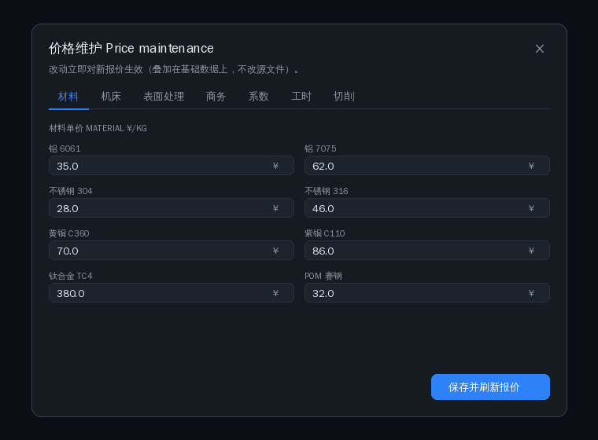

# 价格/参数维护 · Price & Parameter Maintenance

所有报价相关参数均可由管理员在运行时维护，叠加在基础数据上，**不修改源文件**，
改动立即对新报价生效，并写入审计日志（可单条/全部回退）。

## 面板 UI

为避免单页过长，维护面板按**标签页**组织（材料 / 机床 / 表面处理 / 商务 / 系数 /
工时 / 切削），每页只展示该类参数：

## 可维护参数一览

| 标签页 | 参数 | 接口 kind |
|--------|------|-----------|
| 材料 | 单价 ¥/kg、密度、机加工性、毛坯系数、废料抵扣率、抗拉强度 tensile_mpa、备料周期 stock_lead_days | `material` |
| 机床 | 时租 ¥/h、基础 MRR、最大轴数 | `machine` |
| 表面处理 | 起步费、每 dm² 单价、保底费、外协周期 lead_days | `finish` |
| 商务 | 利润率、税率、紧公差利润加成、加急系数、去毛刺基价/单价、包装、运费、起订额、报价有效期、日产能 daily_capacity_hours、刀耗 tool_wear_cny_per_hour、木箱阈值/费用 crate_* | `business` |
| 系数 | 交期档(factor/days)、公差等级(margin/factor/inspection)、表面等级、增项费 | `business`（嵌套路径） |
| 工时 | 编程基准/复杂度、首件、装夹/换刀工时、紧公差系数、每特征检测 inspection_min_per_feature、最小机时、毛坯余量 | `capp` |
| 切削 | 按材料的 Vc/fz/切深/钻孔/vc_tap;**通用循环参数**(选'tools'): 快移/退刀/下刀比/逐孔定位、啄钻触发比/每啄深比/深段降额/每啄余量/钻尖比/螺距近似比 | `cutting` |

接口：`PUT /api/admin/price`（白名单校验 + 审计 **before→after**）、`DELETE /api/admin/price`
（单条回退或 `scope=all`）、`GET /api/admin/config`（当前全量）、`GET /api/admin/audit`。

## 人工新增条目(材料/工艺/机床)

除改字段外,三个目录均支持**面板新增整条**:`PUT/DELETE /api/admin/materials`、
`/api/admin/finishes`(必须带 apply_to 适用材料)、`/api/admin/machines`。
自定义条目存于独立人工层(custom_* 表),在市场价/改价层之前合并,
删除连带清其改价记录;内置条目不可覆盖/删除;全程审计。

完整成本/交期/DFM 模型见 [cost-model.md](cost-model.md)。

> 注：UI 全面禁用 emoji，文案中英双语；改动需管理员登录。
